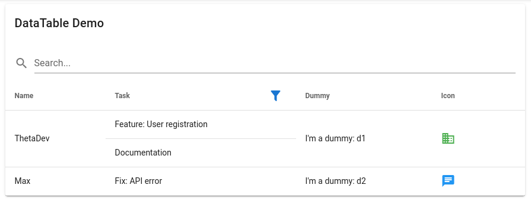

# vuetify-datatable

Vuetify data table that supports search, column filtering and merged rows.



### Example table

| Name     | Task                       | Priority | Progress  | Status         |
|----------|----------------------------|----------|-----------|----------------| 
| ThetaDev | Feature: User registration | 🔸[mid]  | 65%       | Tests:❌ Pr:🔵 |
| ^^^^^^^^ | Documentation              | 🔹[low]  | 15%       | ^^             |
| Max      | Fix: API error             | 🔺[high] | 100%      | Tests:✅ Pr:✅ |

### Table structure

- Column name => TableField component

```js
const tableFields = {
    Name: TableFieldText,
    Task: TableFieldText,
    Priority: TableFieldIconPriority,
    Progress: TableFieldPercent,
    Status: TableFieldStatus,
}
```

### Table data

- Array of items
    - Array of colums
        - Array of data elements/objects

```js
const tableData = [
    [
        ['ThetaDev'],
        ['Feature: User registration', 'Documentation'],
        [2, 3],
        [65, 15],
        [2],
    ],
    [
        ['Max'],
        ['Fix: API error'],
        [2, 3],
        [65, 15],
        [2],
    ]
]
```

### TableField

TableFields define the structure of the table. Here are the required attributes:

**Props:**

- rspan: Rowspan of the table cell
- val: Value (from data object)

**Methods:**

- getSearchable(val): returns string to be searched for (default: null)
- getFilterable(val): returns string to be filtered for (default: null)


### Use in Vue template

```html
<DataTable title="DataTable Demo" :fields="tableFields" :data="tableData"/>
```